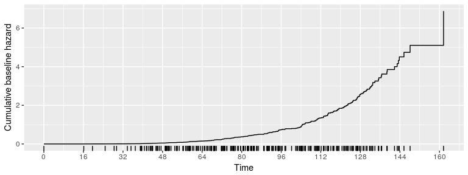

[](https://travis-ci.org/vmonaco/frailtySurv) [](https://cran.r-project.org/web/packages/frailtySurv/index.html)

frailtySurv
-----------

frailtySurv is an R package for simulating and fitting semiparametric shared frailty models.

Installation
------------

For the latest stable version, install from CRAN:

``` r
install.packages("frailtySurv")
```

The development version can be installed from github using `devtools`.

``` r
devtools::install_github("vmonaco/frailtySurv")
```

Example
-------

The following code shows how to generate data and fit the model.

``` r
set.seed(1234)
library(frailtySurv)
#> Loading required package: survival
#> Welcome to frailtySurv
dat <- genfrail(N=200, K=2, beta=c(log(2),log(3)), 
                frailty="gamma", theta=2,
                censor.rate=0.35,
                Lambda_0=function(t, tau=4.6, C=0.01) (C*t)^tau)

fit <- fitfrail(Surv(time, status) ~ Z1 + Z2 + cluster(family), 
                dat, frailty="gamma")
```

``` r
fit
#> Call: fitfrail(formula = Surv(time, status) ~ Z1 + Z2 + cluster(family), 
#>     dat = dat, frailty = "gamma")
#> 
#>      Covariate     Coefficient
#>             Z1           0.654
#>             Z2           1.006
#> 
#> Frailty distribution   gamma(1.802), VAR of frailty variates = 1.802
#> Log-likelihood         -1575.752
#> Converged (method)     10 iterations, 6.81 secs (maximized log-likelihood)
```

Parameter traces are given by

``` r
plot(fit, "trace")
```


The estimated cumulative baseline hazard is given by

``` r
plot(fit, "hazard")
```



The results can be compared to other estimation techniques.

``` r
library(survival)
library(frailtypack)
```

``` r
coxph(Surv(time, status) ~ Z1 + Z2 + frailty.gamma(family), data=dat)
#> Call:
#> coxph(formula = Surv(time, status) ~ Z1 + Z2 + frailty.gamma(family), 
#>     data = dat)
#> 
#>                           coef se(coef)      se2    Chisq  DF       p
#> Z1                      0.6651   0.0941   0.0852  49.9190   1 1.6e-12
#> Z2                      1.0282   0.1046   0.0941  96.5685   1 < 2e-16
#> frailty.gamma(family)                            475.6283 150 < 2e-16
#> 
#> Iterations: 7 outer, 58 Newton-Raphson
#>      Variance of random effect= 1.88   I-likelihood = -1319.6 
#> Degrees of freedom for terms=   0.8   0.8 149.7 
#> Likelihood ratio test=576  on 151 df, p=0  n= 400
frailtyPenal(Surv(time, status) ~ Z1 + Z2 + cluster(family), data=dat, n.knots=10, kappa=2)
#> 
#> Be patient. The program is computing ... 
#> The program took 0.39 seconds
#> Call:
#> frailtyPenal(formula = Surv(time, status) ~ Z1 + Z2 + cluster(family), 
#>     data = dat, n.knots = 10, kappa = 2)
#> 
#> 
#>   Shared Gamma Frailty model parameter estimates  
#>   using a Penalized Likelihood on the hazard function 
#> 
#>       coef exp(coef) SE coef (H) SE coef (HIH)       z          p
#> Z1 0.67236   1.95885   0.0994732     0.0994732 6.75921 1.3875e-11
#> Z2 1.04884   2.85433   0.1191210     0.1191210 8.80481 0.0000e+00
#> 
#>     Frailty parameter, Theta: 1.92378 (SE (H): 0.319435 ) p = 8.5895e-10 
#>  
#>       penalized marginal log-likelihood = -1378.15
#>       Convergence criteria: 
#>       parameters = 0.000362 likelihood = 0.000201 gradient = 2.44e-08 
#> 
#>       LCV = the approximate likelihood cross-validation criterion
#>             in the semi parametrical case     = 3.48287 
#> 
#>       n= 400
#>       n events= 256  n groups= 200
#>       number of iterations:  13 
#> 
#>       Exact number of knots used:  10 
#>       Value of the smoothing parameter:  2, DoF:  11.96
```

Clone and build
---------------

You can clone the repository and build the project from source using RStudio. To create a project in RStudio from this repository, you must have both RStudio and git installed.

-   In RStudio, go to File -\> New Project -\> Version Control -\> Git
-   Name the project (eg. frailtySurv), choose location, and specify the Repository URL as `https://github.com/vmonaco/frailtySurv`

More information about [RStudio and git](https://support.rstudio.com/hc/en-us/articles/200532077-Version-Control-with-Git-and-SVN)

Also see the chapter in the [R packages book](http://r-pkgs.had.co.nz/git.html)

### Build everything

To load the package (simulate installing and loading with `library(frailty)`):

``` r
devtools::load_all()
```

or shortuct: **Ctrl+Shift+L**

Use this command to build a source package (binary = FALSE by default)

``` r
devtools::build()
```

Other usefull commands and shortcuts:

-   Build and reload everything: **Ctrl+Shift+B**
-   Check the package, `devtools::check()`: **Ctrl+Shift+E**
-   Run all tests, `devtools::test()`: **Ctrl+Shift+T**

### Build vignettes

Build the vignettes with the command:

``` r
devtools::build_vignettes()
```

Compiled vignettes will reside in `inst/doc`. In particular, see frailtySurv.pdf

### Run tests

frailtySurv uses the `testthat` library for tests. Test files are all located in `tests/testthat`. To run all tests, use the command `devtools::test()` or shortcut **Ctrl+Shift+T**

### git pull

Use RStudio to pull the latest code if you've already cloned the repository. In the "git" pane, look for the Pull button. You can also view the commit history from there and see the diff between modified files, if any.
